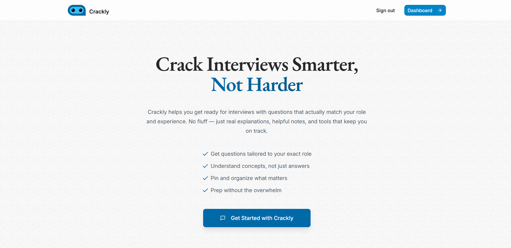

<h1 align="center">Crackly</h1>

<div align="center">

[](https://x.com/akgbytes) &nbsp;
[](https://www.linkedin.com/in/akgbytes/) &nbsp;
[](mailto:akgbytes@gmail.com)&nbsp;
[](https://choosealicense.com/licenses/mit/)

</div>

<div align="center"> 
   
</div>

<br>

## Introduction

**Crackly** is an AI-powered interview assistant that helps users generate personalized interview questions and answers tailored to specific roles, experience levels, and technical topics. Whether you're prepping for your first job or your next big leap, Crackly helps you stay sharp.

<br>

## ✨ Features

- Role-specific interview sets
- Beginner-friendly, concise answers
- Topic-focused question filtering
- Concept breakdowns with examples
- "Pin" and organize your favorite Q&As
- Built to reduce overwhelm, not add to it

<br>

## 🧠 Tech Stack

### Frontend

- [React](https://react.dev/)
- [TypeScript](https://www.typescriptlang.org/)
- [Tailwind CSS](https://tailwindcss.com/)
- [Shadcn UI](https://ui.shadcn.com/)
- [React Hook Form](https://react-hook-form.com/)
- [Lucide React](https://lucide.dev/)

### Backend

- [Node.js](https://nodejs.org/)
- [Express](https://expressjs.com/)
- [Zod](https://zod.dev/)
- [Gemini API](https://ai.google.dev/)
- [Drizzle](https://orm.drizzle.team/)
- [PostgreSQL](https://www.postgresql.org/)
- [BetterAuth](https://www.better-auth.com/)

<br>

## 🛠️ Local Development

### 0. Prerequisites

- [Node.js](https://nodejs.org/)
- [Git](https://git-scm.com/)
- [PostgreSQL](https://www.postgresql.org/) or [Neon DB](https://neon.tech/)

---

### 1. Clone the repository

```bash
git clone https://github.com/akgbytes/crackly.git
```

### 2. Navigate to the project

```bash
cd crackly
```

### 3. Install dependencies

```bash
cd backend && npm install
cd ../frontend && npm install
```

---

### 4. Setup Environment Variables

Copy the example environment file and add your own credentials:

```bash
cp .env.sample .env
```

---

### 5. Setup the database

```bash
cd backend
npx drizzle-kit push
```

---

### 6. Run the app

```bash
# In one terminal
cd backend && npm run dev

# In another terminal
cd frontend && npm run dev
```

Visit [http://localhost:5173](http://localhost:5173) to access Crackly.

---

### 7. Optional: Open Drizzle Studio

```bash
npx drizzle-kit studio
```

View your data at [https://local.drizzle.studio/](https://local.drizzle.studio/)

<br>

## 🤝 Contributing

Contributions and feedback are welcome! Please feel free to open an issue or submit a pull request.

<br>

## 📄 License

Crackly is open-source and licensed under the [MIT License](./LICENSE).
